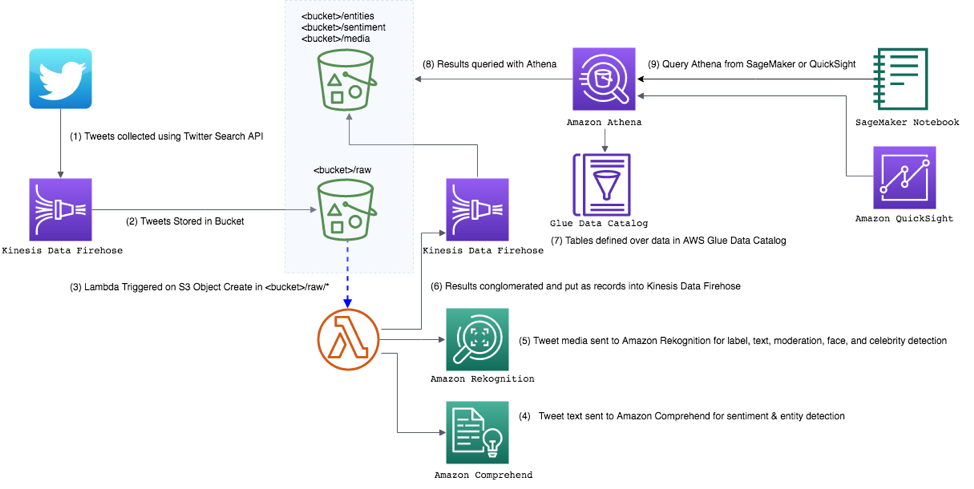

 Exploring Images on Social Media using Amazon Rekognition
================

## Solution Overview
Launch a CloudFormation Template

## To Deploy
Follow the instructions in this [AWS Blog post](https: < TO DO - UPDATE >) to set up a stream from Twitter and analyze the contents.

To deploy manually (i.e., without using the blog "Launch template" bucket):
* Clone this repo
* Copy the files into an S3 bucket, into a directory with the name "socialmediaimageanalysis"
* Follow the instructions in the blog.
* Instead of using the blog's "Launch" button: From the AWS CloudFormation console, execute the template s3://<your_bucket>/socialmediaimageanalysis/deploy.yaml
  directory.
* Change the S3 Bucket the of the Lambda ZIP file to your S3 Bucket.
* Follow the remainder of the instructions in the blog.

## License Summary

This sample code is made available under a modified MIT-0 license. See the LICENSE file.
